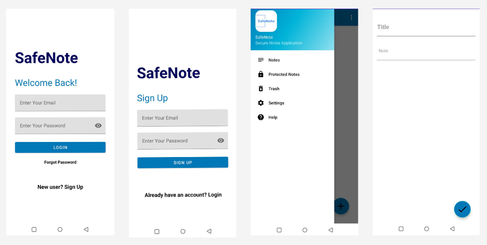

# SafeNote

## About SafeNote
SafeNote is a note-taking Android application that prioritizes user privacy and confidentiality. Personal notes often contain 
sensitive information which can include passwords, financial information, personal details, medical data, and other confidential 
details. Our application lets users store their private information securely.  

## Features

- Note-taking: SafeNote can be used to create, edit and delete text notes. 
- Protected Notes: Users can mark certain notes, which may contain confidential/sensitive information, as protected. These protected notes are present in a separate section of the app which can only be accessed after additional authentication.
- Note encryption: All user notes are encrypted before being stored in the database to protect confidentiality and prevent unauthorized access.
- Authentication: The user is identified by their email and authenticated via password or biometric before being granted access to their notes.
- Backup: User notes are stored on Firebase and can be restored when the application is re-installed, thereby preventing unintended data loss.
- UI: The user interface of the app is intuitive, accessible and easy to use with a clean and minimalistic design that has been developed and improved through usability studies and prototype iterations.
- The app contains additional features including email verification during sign up, forgot password functionality and help section.

## Try it out!
The Android application APK can be downloaded [here](https://drive.google.com/file/d/14XVWPTxhSkQi44cksaiXyl1DV5xqjT5i/view).
The user manual can be viewed [here](https://drive.google.com/file/d/1Deahf7ieb9_hkrhQ5M8Ll1ZDD4vg4CAw/view).

## Design Process
The development of this application involved following the design process 
to understand user needs through user studies, creating lo-fi and mid-fi 
prototypes and evaluating the system by taking feedback from target users.
The design process is documented [here](https://drive.google.com/file/d/1LO8XaGExSfVzPiGsM6rLmxclV08VzDkK/view).
  
## Gallery

